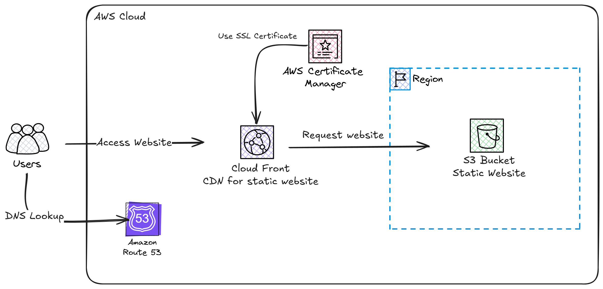

# cirrus
Static website deployment using AWS

### Architecture


### Requirements
```shell
- Terraform CLI >= v1.12
- AWS CLI >= 2.28
- An AWS account and credentials with sufficient permissions
```
### Setup environment variables
```shell
export AWS_ACCESS_KEY_ID=yourAccessKeyID
export AWS_SECRET_ACCESS_KEY=yourSecretAccessKey
export AWS_DEFAULT_REGION=yourAWSRegion
```

### Register a domain
In this setup I've used **DigitalPlat FreeDomain** to issue a free domain. you can use any domain registerer for that purpose.

### Create a Hosted Zone in AWS
From the AWS console create a public Hosted Zone. After that, copy NameServers to your domain registerer as we will need it for issue ssl/tls certificate in validation process.

### Deploy
Initialize:
```shell
terraform init
```
Display resulted Infra
```shell
terraform plan
```
Deploy to AWS
```shell
terraform apply -var-file="custom.tfvars"
```

### Upload files
Upload your static website files to the s3 bucket. then access the website through your custom domain.
